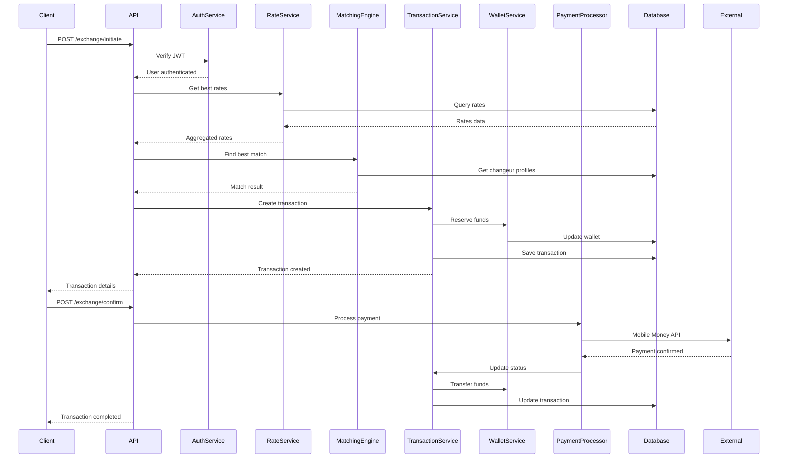

# 🏗️ ARCHITECTURE TECHNIQUE - TREICHVILLE EXCHANGE

## 📐 Vue d'Ensemble

Treichville Exchange utilise une **architecture hexagonale** (Ports & Adapters) pour garantir une séparation claire des responsabilités et une évolutivité maximale.

```
┌─────────────────────────────────────────────────────────────────┐
│                         PRESENTATION LAYER                       │
│  ┌──────────────┐  ┌──────────────┐  ┌────────────────────┐   │
│  │  REST API    │  │  WebSocket   │  │   GraphQL (future) │   │
│  └──────────────┘  └──────────────┘  └────────────────────┘   │
└─────────────────────────────────────────────────────────────────┘
                                │
┌─────────────────────────────────────────────────────────────────┐
│                        APPLICATION LAYER                         │
│  ┌──────────────┐  ┌──────────────┐  ┌────────────────────┐   │
│  │Auth Service  │  │Rate Service  │  │Transaction Service │   │
│  └──────────────┘  └──────────────┘  └────────────────────┘   │
│  ┌──────────────┐  ┌──────────────┐  ┌────────────────────┐   │
│  │Matching Eng. │  │Wallet Service│  │Payment Processor   │   │
│  └──────────────┘  └──────────────┘  └────────────────────┘   │
└─────────────────────────────────────────────────────────────────┘
                                │
┌─────────────────────────────────────────────────────────────────┐
│                          DOMAIN LAYER                            │
│  ┌──────────────┐  ┌──────────────┐  ┌────────────────────┐   │
│  │    User      │  │     Rate     │  │   Transaction      │   │
│  └──────────────┘  └──────────────┘  └────────────────────┘   │
│  ┌──────────────┐  ┌──────────────┐  ┌────────────────────┐   │
│  │   Wallet     │  │    Crypto    │  │   ChangeurProfile  │   │
│  └──────────────┘  └──────────────┘  └────────────────────┘   │
└─────────────────────────────────────────────────────────────────┘
                                │
┌─────────────────────────────────────────────────────────────────┐
│                      INFRASTRUCTURE LAYER                        │
│  ┌──────────────┐  ┌──────────────┐  ┌────────────────────┐   │
│  │  PostgreSQL  │  │    Redis     │  │   External APIs    │   │
│  └──────────────┘  └──────────────┘  └────────────────────┘   │
│  ┌──────────────┐  ┌──────────────┐  ┌────────────────────┐   │
│  │ TimescaleDB  │  │   Binance    │  │   Mobile Money     │   │
│  └──────────────┘  └──────────────┘  └────────────────────┘   │
└─────────────────────────────────────────────────────────────────┘
```

## 🎯 Principes Architecturaux

### 1. **Domain-Driven Design (DDD)**
- Entités métier au cœur du système
- Ubiquitous Language aligné avec le métier
- Bounded Contexts clairs

### 2. **Separation of Concerns**
- **Domain**: Logique métier pure
- **Application**: Orchestration et use cases
- **Infrastructure**: Détails techniques
- **Presentation**: Interface utilisateur

### 3. **Dependency Inversion**
- Les couches internes ne dépendent pas des externes
- Injection de dépendances via traits
- Testabilité maximale

## 🔄 Flow de Données

### Transaction Flow Exemple



## 💾 Data Architecture

### Database Schema

```sql
┌─────────────────┐     ┌─────────────────┐
│     users       │────<│  refresh_tokens │
└─────────────────┘     └─────────────────┘
         │
         │ 1:1
         ▼
┌─────────────────┐     ┌─────────────────┐
│changeur_profiles│     │    wallets      │
└─────────────────┘     └─────────────────┘
         │                       │
         │ 1:N                   │
         ▼                       │
┌─────────────────┐             │
│ exchange_rates  │             │
└─────────────────┘             │
         │                       │
         │ 1:N                   │
         ▼                       ▼
┌─────────────────────────────────────┐
│          transactions                │
└─────────────────────────────────────┘
                 │
                 │ 1:N
                 ▼
┌─────────────────────────────────────┐
│       transaction_events             │
└─────────────────────────────────────┘
```

### Cache Strategy

```
Redis Cache Layers:
├── L1: Hot Data (30s TTL)
│   ├── Public rates
│   ├── Best rates by amount
│   └── Active changeur rates
├── L2: Session Data (1h TTL)
│   ├── User sessions
│   ├── Transaction locks
│   └── Reservation data
└── L3: Reference Data (24h TTL)
    ├── Currency pairs
    ├── Fee structures
    └── Configuration
```

## 🔐 Security Architecture

### Authentication & Authorization

```
JWT Token Flow:
1. Login → Generate Access (15min) + Refresh (7d) tokens
2. Request → Validate Access token
3. Expired → Use Refresh token to get new Access token
4. Logout → Blacklist tokens in Redis
```

### Rate Limiting

```rust
Per User: 100 req/min
Per IP: 1000 req/min
Per Endpoint: Custom limits
WebSocket: 10,000 concurrent connections
```

## 🚀 Performance Optimizations

### 1. **Database**
- Connection pooling (100 connections)
- Prepared statements
- Indexed queries
- TimescaleDB for time-series

### 2. **Caching**
- Redis for hot data
- Multi-level cache
- Cache-aside pattern
- Automatic invalidation

### 3. **Async Processing**
- Tokio runtime
- Non-blocking I/O
- Concurrent request handling
- Background job processing

### 4. **Code Optimizations**
- Zero-copy where possible
- Lazy loading
- Query batching
- Efficient serialization

## 📊 Monitoring & Observability

### Metrics Collection

```
OpenTelemetry → Prometheus → Grafana

Tracked Metrics:
- Request latency (p50, p95, p99)
- Error rates
- Transaction volumes
- Cache hit rates
- Database query times
```

### Distributed Tracing

```
Jaeger Integration:
- Request flow visualization
- Performance bottleneck detection
- Error propagation tracking
- Service dependency mapping
```

### Logging

```
Structured Logging (JSON):
- Request ID correlation
- User context
- Error stack traces
- Audit trail
```

## 🔄 Deployment Architecture

### Container Strategy

```yaml
Services:
  app:
    - 3 replicas minimum
    - Auto-scaling based on CPU/Memory
    - Health checks every 30s
    
  postgres:
    - Primary + 2 Read replicas
    - Automated backups
    - Point-in-time recovery
    
  redis:
    - Redis Cluster mode
    - 3 masters, 3 slaves
    - Persistence enabled
```

### High Availability

```
Load Balancer (nginx/HAProxy)
       │
   ┌───┴───┐
   │       │
App-1   App-2   App-3
   │       │       │
   └───┬───┘       │
       │           │
   Database    Redis
   Cluster     Cluster
```

## 🔮 Future Architecture Evolution

### Phase 1 (Current)
- Monolithic with modular design
- Single database
- Basic caching

### Phase 2 (6 months)
- Microservices extraction
- Event-driven architecture
- CQRS for read/write separation

### Phase 3 (1 year)
- Full microservices
- Kafka for event streaming
- GraphQL Federation
- Multi-region deployment

## 📚 Architecture Decision Records (ADRs)

### ADR-001: Rust + Axum
**Decision**: Use Rust with Axum framework
**Rationale**: Performance critical for financial operations
**Consequences**: Longer development time, better performance

### ADR-002: PostgreSQL + TimescaleDB
**Decision**: PostgreSQL with TimescaleDB extension
**Rationale**: ACID compliance + time-series capabilities
**Consequences**: Single database complexity, easier operations

### ADR-003: Redis for Caching
**Decision**: Redis for all caching needs
**Rationale**: Proven, fast, supports pub/sub
**Consequences**: Additional infrastructure, improved performance

### ADR-004: JWT Authentication
**Decision**: JWT with refresh token rotation
**Rationale**: Stateless, scalable, secure
**Consequences**: Token management complexity, better scalability

### ADR-005: Event Sourcing for Transactions
**Decision**: Event sourcing pattern for transaction audit
**Rationale**: Complete audit trail, regulatory compliance
**Consequences**: Storage overhead, perfect traceability